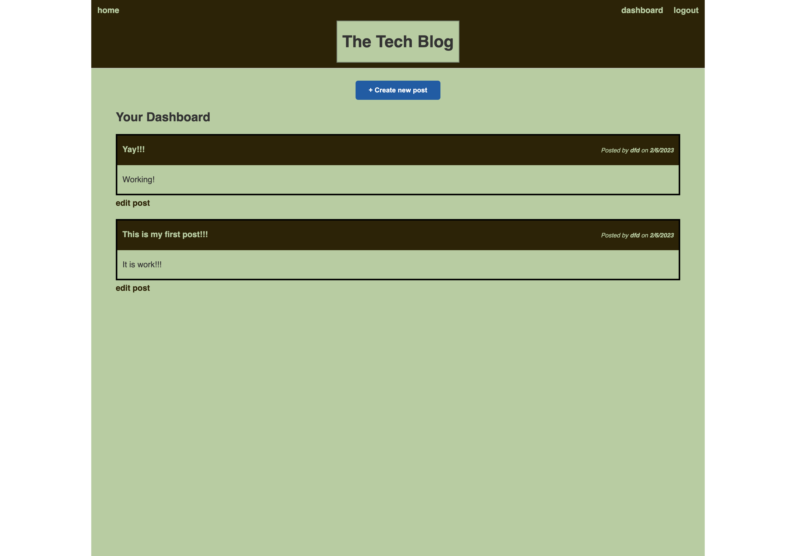

## Tech Blog

# Description

This application allows various different users to create an account and post blog posts. Users can also edit and delete their own posts. It also allows them to comment on posts from other users.

## Contents
* [Usage](#usage)
* [Screenshots](#screenshots)
* [Built With](#built-with)

## Usage
npm install 

## Built With

* HTML
* CSS
* JavaScript
* Node.js
* Express.js

# Screenshot

# Application Link

## Questions
If you have any questions about the repo, please [open an issue]("https://github.com/Donglee0415/Power-Bloger/issues") or contact me via email at dn.lee0415@gmail.com. You can find more of my work on my GitHub, [donglee0415]("https://github.com/Donglee0415/Power-Bloger").

